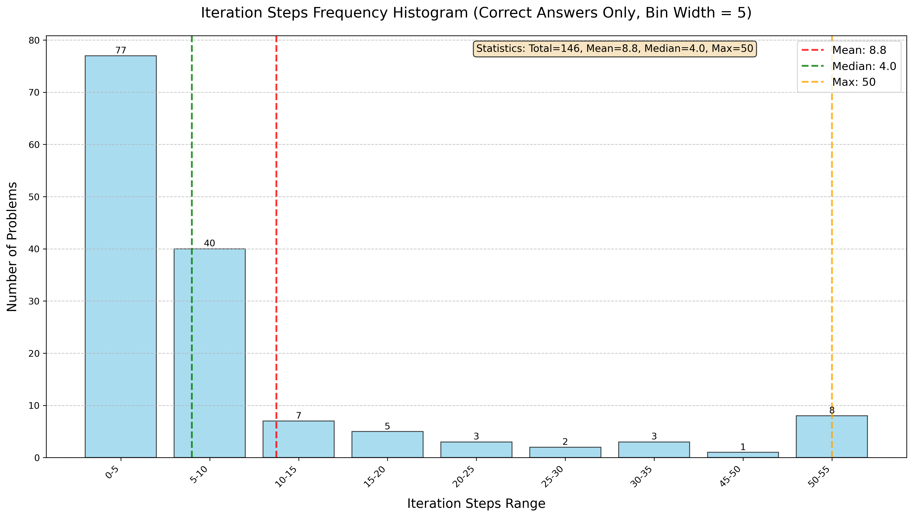
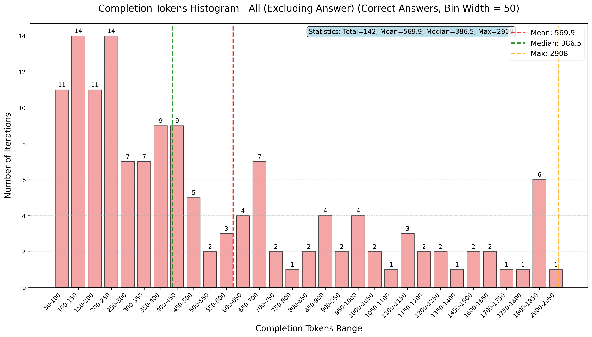
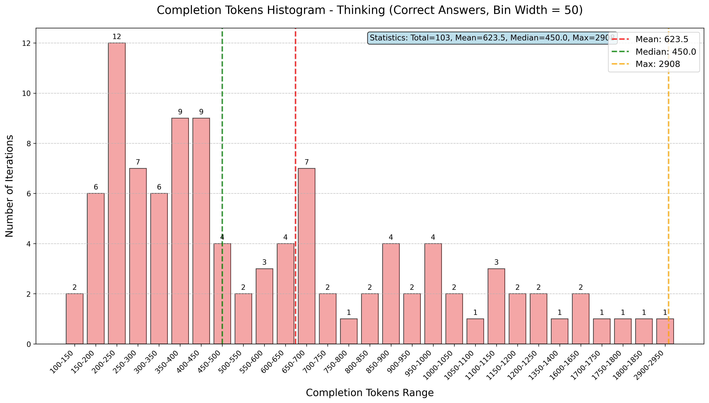
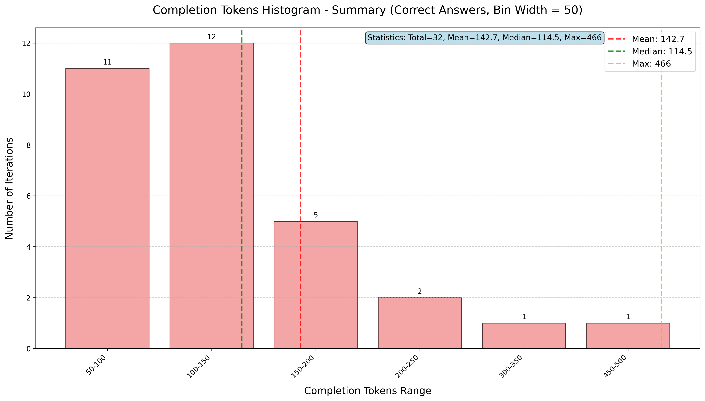
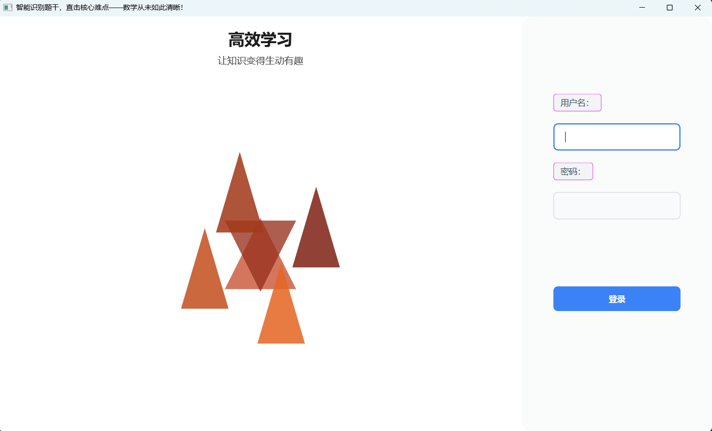

# 基于大语言模型的迭代多步推理数学题求解器

<p align="center">
  <b>Iterative Multi-step Reasoning Mathematical Problem Solver Based on Large Language Models</b>
</p>

<p align="center">
  
  
  
  
</p>

---

## 📋 项目简介

本项目提出了一种**基于大语言模型（LLM）的多智能体迭代推理-摘要框架**，专门用于解决高难度数学问题。

传统的单次调用方式让 LLM 一步给出答案，在复杂数学题上常常力不从心。本项目的核心思路是：**将完整的推理过程拆分为多个独立的迭代步骤**，每一步由同一个 LLM 扮演不同角色（思考智能体 / 摘要智能体 / 答案智能体）完成单一操作，并通过**摘要（Summary）机制压缩上下文**，使得每一步的推理都能在有限的上下文窗口内高效进行。

> 详细介绍可参阅项目中的 `docs/总结报告.pdf` 和 `docs/实验记录.docx`。

---

## 🔍 研究背景与动机

- 大语言模型在复杂、多步骤数学推理任务中存在**上下文长度限制**与**单次推理深度不足**的问题。
- 现有 Chain-of-Thought（CoT）方法虽有改进，但在极难题目（如 MATH 数据集难度 5 级）上仍有较大提升空间。
- 本项目借鉴多智能体协作思想，通过**迭代思考 → 摘要压缩 → 继续推理**的循环，让模型在不超出上下文限制的前提下完成深度多步推理。

---

## 🏗️ 系统架构与研究思路

### 核心流程

```
用户问题
   │
   ▼
┌──────────────────────────────────────────────────────┐
│                   多智能体迭代推理循环                  │
│                                                      │
│  ① 初始思考（<think>）                                │
│     └─ 无历史上下文，针对原始问题进行初始推理           │
│                                                      │
│  ② 生成摘要（<summary>）                              │
│     └─ 压缩已有思考，提炼关键信息和当前推理状态         │
│                                                      │
│  ③ 继续推理（<think>）                                │
│     └─ 仅凭摘要+原问题继续推进，不保留完整历史          │
│                                                      │
│  重复 ②③ 直到推理完整                                 │
│                                                      │
│  ④ 最终答案（<answer>）                               │
│     └─ 确认推理完整后输出最简洁的最终答案               │
└──────────────────────────────────────────────────────┘
   │
   ▼
最终答案
```

### 关键设计原则

| 设计要点                 | 说明                                                             |
| ------------------------ | ---------------------------------------------------------------- |
| **单一操作规则**   | 每次 LLM 调用只执行一个操作（思考/摘要/答案），避免混乱          |
| **摘要压缩机制**   | 下一步只接收摘要+原问题，而非完整推理历史，控制上下文增长        |
| **结构化标签输出** | 使用 `<think>` / `<summary>` / `<answer>` 标签区分操作类型 |
| **最大迭代限制**   | 设置最大迭代次数防止无限循环                                     |
| **AI 辅助评判**    | 使用 LLM 辅助判断模型答案与标准答案的等价性                      |

### 答案评估方法

由于数学答案可能有多种等价表达形式（如 `1/2 = 0.5 = 50%`），项目采用了 **AI 辅助等价性判断**：将模型答案和标准答案同时提交给 LLM，由其判断两者是否在数学上等价，输出 `[[YES]]` 或 `[[NO]]`。

---

## 🛠️ 技术栈

| 类别                 | 技术/工具                                           |
| -------------------- | --------------------------------------------------- |
| **大语言模型** | DeepSeek-Chat（通过 API 调用）                      |
| **编程语言**   | Python 3                                            |
| **HTTP 请求**  | `requests`                                        |
| **数据处理**   | `json`, `regex`                                 |
| **可视化分析** | `matplotlib`, `numpy`                           |
| **GUI 原型**   | `tkinter`                                         |
| **数据集**     | MATH 竞赛数学数据集（按难度 1-5 分级）              |
| **计算成本**   | DeepSeek 定价：输入 $2/1M tokens，输出 $8/1M tokens |

---

## 📂 项目结构

```
.
├── analysis/                      # 分析脚本、日志与根目录实验结果
│   ├── completion_tokens_analysis.py  # Token 使用量分析脚本
│   ├── getdata.py                 # 迭代步数直方图生成脚本
│   ├── final_summary.log          # 分析汇总日志
│   └── multi_metrics*.json        # 多智能体实验结果（根目录原始汇总）
├── assets/
│   └── images/                    # 项目图片资源
│       ├── UI.png                 # App 界面示意图
│       ├── ittrue.png             # 实验结果图
│       ├── iteration_steps_histogram.png
│       └── completion_tokens_histogram*.png
├── docs/                          # 项目文档资料
│   ├── poster (1).pptx            # 项目展示海报
│   ├── 实验记录.docx               # 详细实验记录
│   └── 总结报告.pdf                # 项目总结报告
├── math/                          # 核心实验代码目录
│   ├── process.py                 # 多智能体迭代推理主程序（基础版）
│   ├── process2.py                # 改进版（新增 FLOPs 统计）
│   ├── process3.py                # 完整版（AI 辅助答案评估）
│   ├── test1.py / test1 copy*.py  # 早期探索性脚本
│   ├── systemprompt.txt           # 多智能体系统提示词
│   ├── s_prompt.txt               # 单步求解系统提示词
│   ├── mainview.py                # GUI 原型界面
│   ├── find_max_problem.py        # 查找最大迭代问题工具
│   ├── data/                      # MATH 数据集（按难度分级）
│   │   ├── difficulty_1.json      # 难度1（90题）
│   │   ├── difficulty_2.json      # 难度2（102题）
│   │   ├── difficulty_3.json      # 难度3（138题）
│   │   ├── difficulty_4.json      # 难度4（137题）
│   │   └── difficulty_5.json      # 难度5（146题，主要评测集）
│   └── result/                    # 实验结果（JSON 格式）
└── README.md
```

---

## 📊 实验结果

### 评测数据集

所有实验主要在 **MATH 数据集难度 5 级**（146 道题，最高难度）上进行评测。

### 多智能体 vs 单智能体对比

| 方法                        | 问题数 | 正确数 | 准确率           | 总 FLOPs              |
| --------------------------- | ------ | ------ | ---------------- | --------------------- |
| 单步直接回答（Single-step） | 146    | 112    | **76.71%** | 651,039,582           |
| 多智能体迭代推理（本方法）  | 146    | 111    | 76.03%           | **347,372,174** |

> **关键发现**：在最高难度数据集下，多智能体迭代方法的准确率与单步方法相近（差距不足 1%），但其 **总 FLOPs 几乎降低了一半（减少约 46.6%）**，显著减轻了模型的计算压力，体现了多步方法在计算资源利用上的巨大优势。

### 不同最大迭代次数的影响（难度5级，146题）

| 最大迭代次数                          | 正确数 | 准确率           | 平均迭代步数 | 优化状态                            |
| ------------------------------------- | ------ | ---------------- | ------------ | ----------------------------------- |
| 5 步                                  | 76     | 52.05%           | 3.72         | 欠拟合（受限于迭代次数）            |
| 22 步                                 | 108    | 73.97%           | 3.79         | 稳定较佳                            |
| 30 步                                 | 95     | 65.07%           | 7.53         | N/A                                 |
| 50 步                                 | 89     | 60.96%           | 8.75         | N/A                                 |
| **最优限制**（步数22+长度优化） | 111    | **76.03%** | 3.77         | **最优表现（FLOPs大幅降低）** |

> **结论**：选取 **22步** 作为迭代阈值最能在保证高准确率的情况下避免死循环；过少（5步）会导致推理中止，过多（50步）则带来无效推理进而增加无谓的 FLOPs 消耗和出错率。经过迭代步数与 `max_token` 的双重优化后，模型达到了准确率与极低计算量（FLOPs）的完美平衡。

### 迭代步数分布

下图展示了正确回答问题的迭代步数分布（仅统计正确答案）：



### Completion Tokens 分布分析

通过对每次迭代中 `completion_tokens` 的分析，可以了解模型在思考（thinking）和摘要（summary）阶段的输出长度分布：

| 分析维度                | 直方图                                                          |
| ----------------------- | --------------------------------------------------------------- |
| 全部类型（排除 answer） |  |
| 思考阶段（thinking）    |              |
| 摘要阶段（summary）     |               |

---

## 🚀 快速开始

### 环境要求

```bash
pip install requests regex matplotlib numpy
```

### 运行多智能体求解器

```python
# 以 process3.py 为例（完整版，含 AI 答案评估）
cd math
python process3.py
```

脚本会自动读取 `data/difficulty_5.json` 中的题目，逐题进行迭代推理，并将结果保存至 `result/multi_metrics_N.json`。

### 数据分析与可视化

```bash
# 分析迭代步数分布
python analysis/getdata.py

# 分析 Token 使用量
python analysis/completion_tokens_analysis.py
```

### 系统提示词格式

多智能体系统提示词定义了 LLM 在每次迭代中的行为规则：

```
流程：初始思考 → 生成摘要 → 继续推理 → 生成摘要 → ... → 最终答案

每次响应只能选择一个操作：
- <think>...</think>     : 初始思考或继续推理
- <summary>...</summary> : 压缩当前推理状态
- <answer>...</answer>   : 提供最终答案（仅在推理完整时使用）
```

---

## 📈 主要发现与结论

1. **难度与适用性**：在低难度问题中，单步求解法在准确率和FLOPs（计算量）上均优于多步方法；而在高难度（难度四及以上）问题中，多步迭代法能显著降低生成回答所需的 completion tokens 和模型的总 FLOPs，体现出多步迭代方法在求解高难度数学题上的优越性。
2. **最佳迭代步数阈值**：综合考量准确率、FLOPs 和 Tokens 消耗，选取 **22** 作为多步求解的最大迭代步数阈值最为合理，能够有效避免资源浪费并确保求解完整性。
3. **最佳 Token 参数限制**：通过无长度限制下各部分消耗的分布规律验证，得出各模块最佳 token 参数取值：思考阶段（`<think>`）限制在 **444**，摘要阶段（`<summary>`）限制在 **252**，答案输出（`<answer>`）为 **50**，整体 `max_token` 设为 **1500**。
4. **整体优化效果**：经过迭代步数与长度限制优化后的多步求解器，其整体 FLOPs 远小于单步求解（降低了一半左右的计算量），并且准确率与单步求解之间的差距缩小到了 **1%** 以内。

---

## 📁 实验数据说明

| 文件名                         | 说明                                                                                    |
| ------------------------------ | --------------------------------------------------------------------------------------- |
| `analysis/multi_metrics_5.json`       | 早期无限制tokens，100题，主要用于寻找最适截断参数                                       |
| `analysis/multi_metrics_6.json`       | **最优多步方法结果**（步数=22，合理Token截断），准确率76.03%，FLOPs为 347,372,174 |
| `analysis/multi_metrics30_2.json`     | 最大30步迭代，146题，准确率65.07%                                                       |
| `analysis/multi_metrics50_1.json`     | 最大50步迭代，146题，准确率60.96%                                                       |
| `analysis/multi_metrics22_2.json`     | 初步最大22步迭代，146题，准确率73.97%                                                   |
| `analysis/multi_metrics5_4.json`      | 最大5步迭代，146题，准确率52.05%                                                        |
| `math/single_metrics_4.json` | 单步基线，146题，**准确率76.71%**，FLOPs为 651,039,582                            |

---

## 🧩 App 目录使用说明

`app/the-app` 目录下提供了 GUI 版本原型：

- `app.py`：包含登录页面与主界面切换逻辑。
- `app2.py`：包含聊天界面与多轮调用逻辑。



### 登录信息（原始账号密码）

在 `app/the-app/app.py` 的登录校验中，默认凭据为：

- **用户名**：`dais`
- **密码**：`123456`

### API 密钥配置（app2）

在 `app/the-app/app2.py` 的 `send_message` 方法中，默认是：

```python
api_key = ""
```

使用前请将其替换为你自己的 API 密钥，否则 `app2` 无法正常调用模型接口。

可在 `app/the-app` 目录运行：

```bash
python app.py
```
---

## 📄 参考资料

- [DeepSeek API 文档](https://platform.deepseek.com/)
- [MATH 数据集](https://arxiv.org/abs/2103.03874)（Hendrycks et al., 2021）
- Chain-of-Thought Prompting（Wei et al., 2022）

---

<p align="center">
  如需详细了解实验设计与分析，请参阅 <code>docs/总结报告.pdf</code> 和 <code>docs/实验记录.docx</code>
</p>
